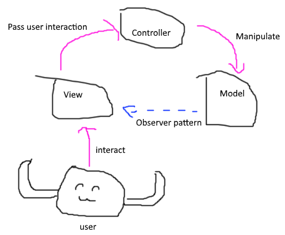

# MVC Pattern
a simple mvc pattern

## Demo
check out [a counter app](drakeleung.github.io/demo/patterns/mvc/index.html)
  
## How to Write
Look at this picture first.
After that, You can write the code follow the picture.

## View
- template

## Controller
- render view
- register event
- deal with event: manually make View listen to Model, and re-render View

## Model
- get attributes
- set attributes, and **emit corresponding event**

## Event
- implement *Observer Pattern*

## Resource
- [Basic JavaScript MVC Implementation](https://gist.github.com/g6scheme/4157554)
- [界面之下：还原真实的MV*模式](https://github.com/livoras/blog/issues/11)